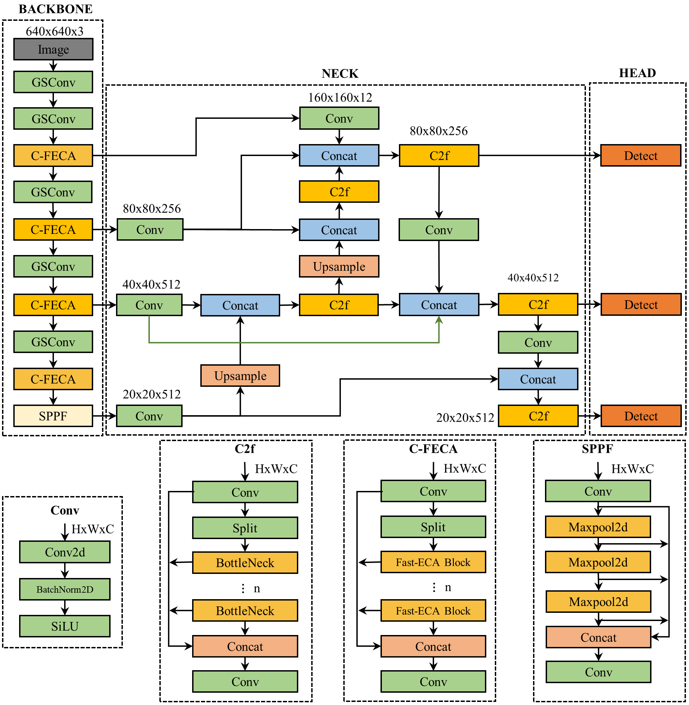
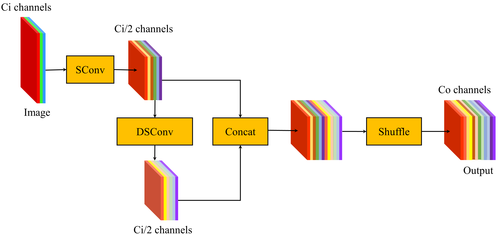
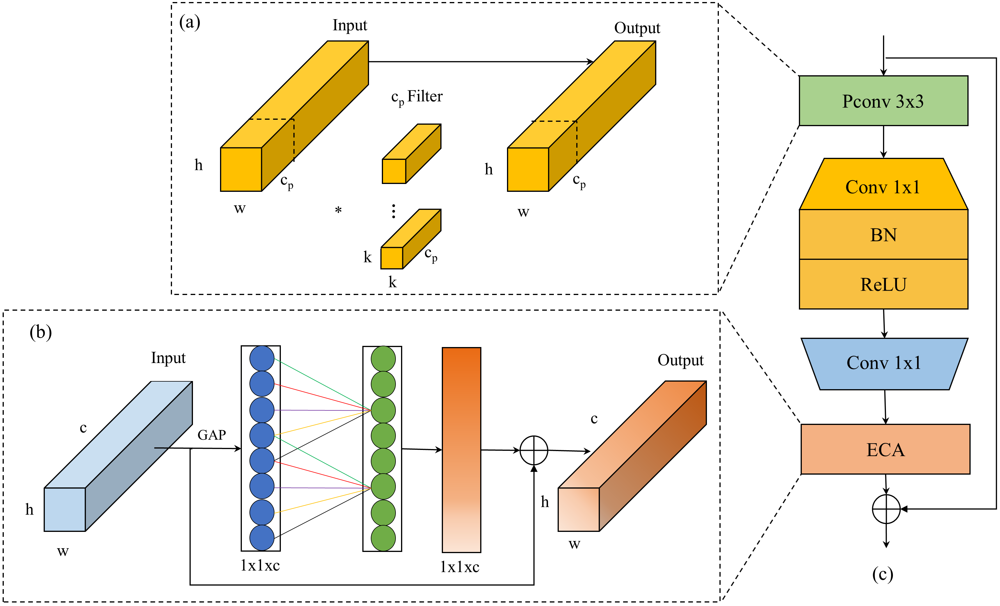
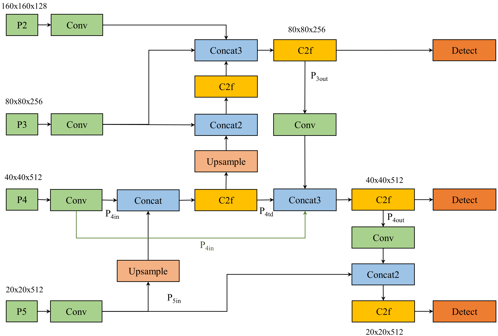
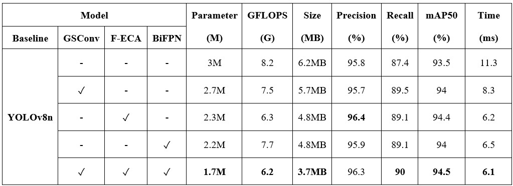

# A Lightweight and Optimized Deep Learning Model for Detecting Banana Clusters and Stems in Autonomous Harvesting Vehicles

Developing algorithms to identify fruit cutting locations is important for the functionality of harvesting robots. However, existing studies frequently utilize multi-stage detection processes, which complicate system design and hinder real-time operation. To overcome those challenges, this study proposes an optimized **Banana-DL** model capable of simultaneously detecting banana clusters and stems in orchard environments for banana harvesting robots. 

The proposed model is based on the YOLOv8n baseline and incorporates enhancements to improve accuracy while maintaining a lightweight architecture:
- Replacing standard convolution layers with a lightweight **GSConv** structure.
- Introducing a novel **C2f-Fast Efficient Channel Attention (C-FECA)** module for improved feature extraction.
- Incorporating a **BiFPN** module to enhance feature aggregation and adaptability to varying environmental conditions.

Experimental results demonstrate that the Banana-DL model achieves superior performance:
- **Precision:** 96.3%
- **Recall:** 90%
- **mAP50:** 94.5%
- Model size: **3.7MB** (40.3% reduction)
- Parameters: **1.7M** (43.3% reduction)

These advancements make Banana-DL highly suitable for deployment on embedded systems in agricultural robots.

---

## 1. Architecture of the Proposed Detection Model

  
*Figure 1: Architecture of the proposed detection model.*

**Description:**  
The architecture is based on the YOLOv8n baseline with key enhancements: lightweight GSConv structure replacing standard convolution, the proposed C-FECA module replacing the original C2f module, and BiFPN module incorporated in the neck to improve feature aggregation and adaptability to diverse environmental conditions.

---

## 2. Group-shuffle Convolution Module (GSConv)

  
*Figure 2: GSConv structure in the model architecture.*

**Description:**  
GSConv replaces standard convolution layers with a group-channel architecture, reducing parameters and increasing processing speed.

---

## 3. C2f - Fast Efficient Channel Attention Module (C-FECA)

  
*Figure 3: C-FECA module for faster and more efficient channel attention.*

**Description:**  
C-FECA enhances the model's ability to focus on important regions in images, thereby improving accuracy.

---

## 4. Bi-directional Feature Pyramid Network (BiFPN)

  
*Figure 4: BiFPN in the improved YOLOv8 architecture.*

**Description:**  
BiFPN optimizes the aggregation of features across multiple scales, improving the detection of small objects.

---

## 5. Ablation Experiments

  
*Figure 5: Detection results of different models in ablation experiments.*

---

## 6. Detection Performance Between Different Models

  
*Figure 6: Training curves of different models.*

---

## 7. Grad-CAM Visualization of the Proposed Model

  
*Figure 7: Grad-CAM visualization of the proposed model.*

---

## Conclusion

In this study, the Banana-DL model was successfully developed as an optimized solution for detecting banana clusters and stems in orchard environments. By integrating lightweight GSConv structures, the C-FECA module, and the BiFPN network, the model achieves:
- Higher accuracy compared to baseline and state-of-the-art models.
- Significant reductions in model size and computational complexity.

These results validate the feasibility of deploying Banana-DL on embedded systems for agricultural robots, offering an efficient approach to real-time harvesting operations.

---
## Acknowledgments

The authors express gratitude for the support and resources provided by the Biomimicking and Engineering Lab (Being2 Lab) at National Sun Yat-sen University, Kaohsiung, Taiwan.

