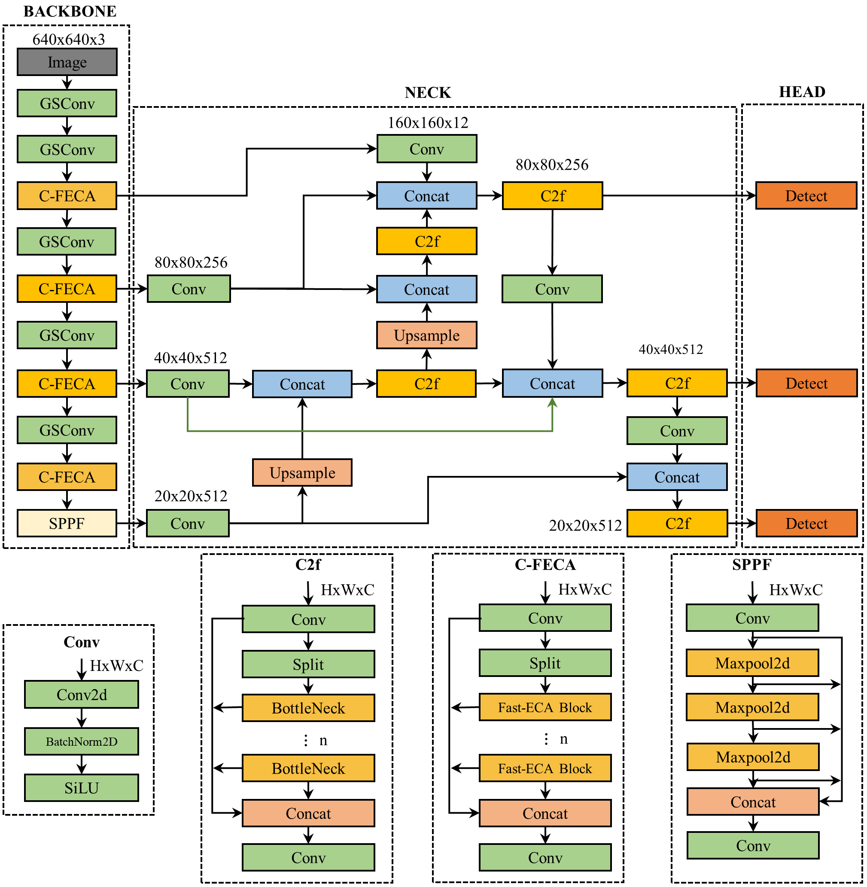
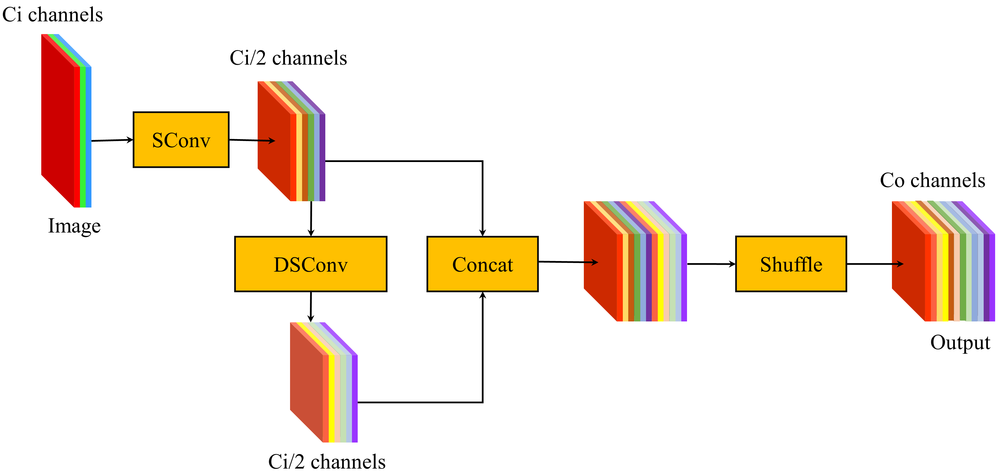
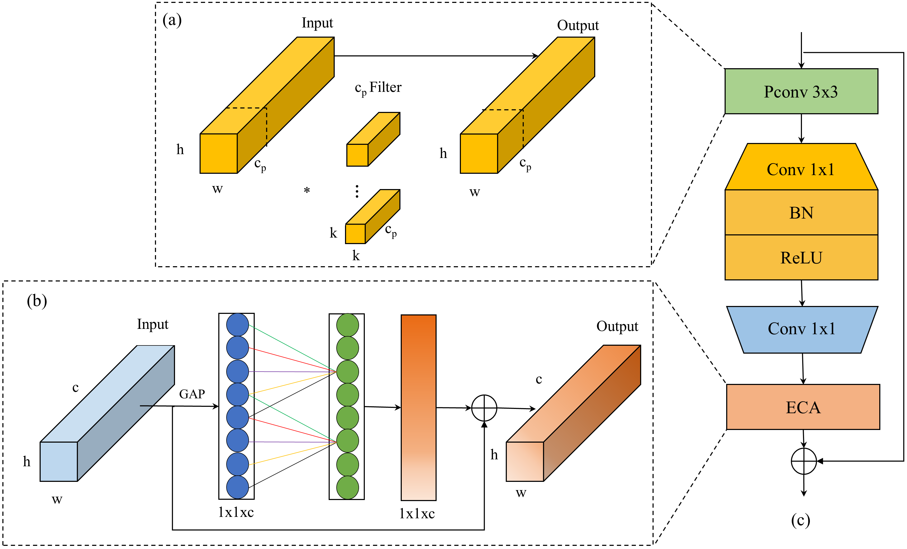
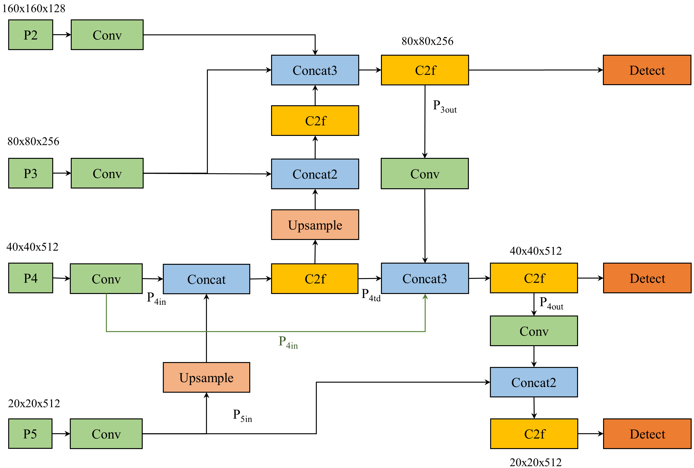

# Kết quả nghiên cứu: Phân tích và cải tiến kiến trúc mô hình YOLOv8

Dưới đây là các phần chính trong nghiên cứu về cải tiến YOLOv8 với các module mới, bao gồm Banana_DL architecture, GSConv, C-FECA, BiFPN, và Evaluation.

---

## 1. Banana_DL Architecture

*Hình 1: Sơ đồ kiến trúc Banana_DL.*

**Miêu tả:** 
Banana_DL Architecture là kiến trúc nền tảng được thiết kế để cải thiện hiệu suất phát hiện đối tượng trong nông nghiệp. Nó kết hợp các module chuyên dụng nhằm tối ưu hóa việc xử lý hình ảnh.

---

## 2. GSConv

*Hình 2: Cấu trúc GSConv trong kiến trúc mô hình.*

**Miêu tả:** 
GSConv thay thế các lớp Conv thông thường bằng cách sử dụng kiến trúc nhóm-kênh (group-channel), giúp giảm số lượng tham số và tăng tốc độ xử lý.

---

## 3. C-FECA

*Hình 3: Module C-FECA với kênh chú ý nhanh và hiệu quả.*

**Miêu tả:** 
C-FECA (C2f-Faster-Efficient Channel Attention) được sử dụng để nâng cao khả năng tập trung vào các vùng quan trọng trong hình ảnh, giúp cải thiện độ chính xác.

---

## 4. BiFPN

*Hình 4: BiFPN trong kiến trúc YOLOv8 cải tiến.*

**Miêu tả:** 
BiFPN (Bidirectional Feature Pyramid Network) giúp tối ưu hóa việc tổng hợp các đặc trưng từ nhiều mức độ khác nhau, cải thiện khả năng phát hiện các đối tượng nhỏ.

---

## 5. Evaluation

*Hình 5: Biểu đồ kết quả đánh giá mô hình.*

**Miêu tả:** 
Biểu đồ thể hiện hiệu suất mô hình được cải tiến với các chỉ số như Precision, Recall, mAP50 và mAP50-95. Kết quả cho thấy sự vượt trội so với kiến trúc gốc.

---

**Kết luận:** 
Các cải tiến trên đã giúp tăng đáng kể hiệu suất mô hình YOLOv8 trong việc phát hiện và phân loại các đối tượng trong bối cảnh nông nghiệp.
